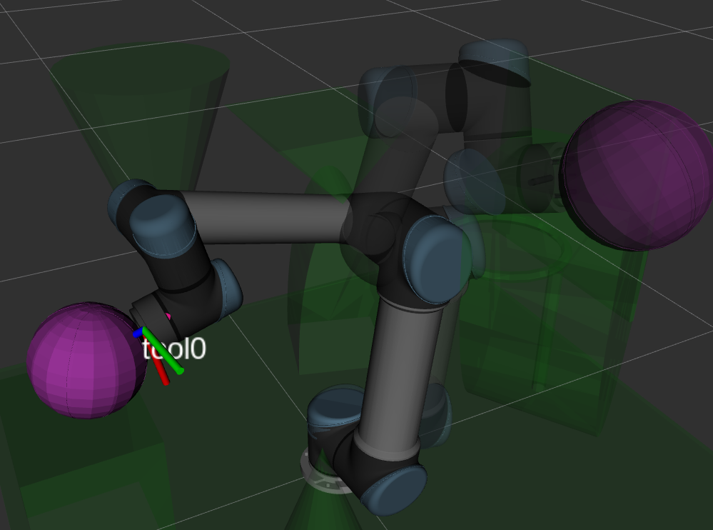

# QUT ROS Workshop 4: MoveIt! Slam DUNK



## Setup

```bash
sudo apt install ros-melodic-moveit python-catkin-tools
source /opt/ros/melodic/setup.sh
catkin build
```

```bash
source devel/setup.sh
roslaunch moveit_setup_assistant setup_assistant.launch
```

## Running The Script

```bash
source devel/setup.sh
roslaunch slam_dunk_moveit_config demo.launch
```

And in another terminal:

```bash
source devel/setup.sh
python3 slam_dunk.py
```

## Workshop Instructions

Follow along with the [Workshop Slides](https://docs.google.com/presentation/d/1bqUCLDICMg0CD7Tia0VFK1l_IqdKAusYh1RacY6YJoI/edit?usp=sharing)
